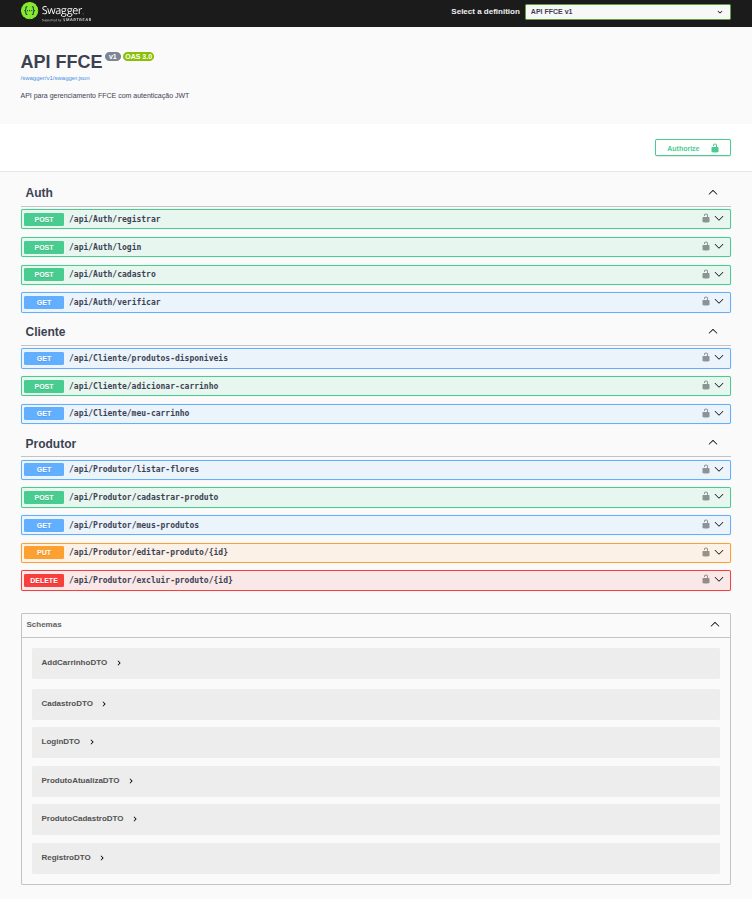

# Observações para o Front-End
- O Front-End deve ser colocado dentro da pasta wwwroot/
- O Front-End deve consumir a API. Existem vários maneiras de fazer isso, mas depende da tecnologia utilizada. Com Javascript puro é feito fetch, com React é feito com fetch ou axios...
- A estilização do Front-End não é a parte principal aqui. O importante é o Front-End consegui consumir a API e o projeto ser funcional.  

# Fluxo da Aplicação
## Registro
No Cadastro, será feito a autenticação na URL /api/Auth/{...}
Aqui será definido a Role do usuário, que poderá ser Cliente ou Produtor.

## Cadastro (somente se for Produtor)
Se a Role do usuário for Produtor, logo após o primeiro Login (ou alguma solução similar encontrada pelo Front-End) o Produtor deve
realizar o seu cadastro. A URL está definida como /api/Auth/cadastro. Toda a API
está documentada pelo Swagger, basta dar um dotnet build e acessar o localhost.
Aqui está o que você deve ver ao rodar o Projeto:

## Cliente
O cliente deve ver os produtos disponíveis, adicionar ao carrinho e ver seu carrinho.

## Produtor
O produtor deve conseguir ver as flores, cadastrar produtos, ver seus produtos, editar produtos e excluir os produtos. É importante ressaltar que as flores já foram populadas no banco por padrão. O Produtor não conseguirá adicionar Imagens/Flores/Produtos/etc que já não foram adicionados no banco. Você consegue ver as flores que já foram adicionadas no wwwroot/images do projeto.

